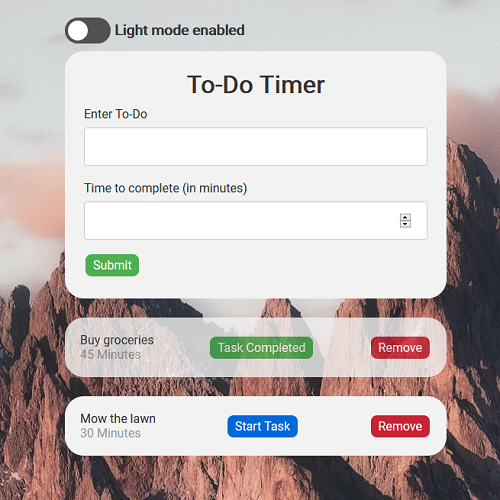

# To-Do Timer

The To-Do Timer allows you to add to-do list items along with the estimated time to complete the task. Once you start the task, a timer will count down the time entered in for that task.

